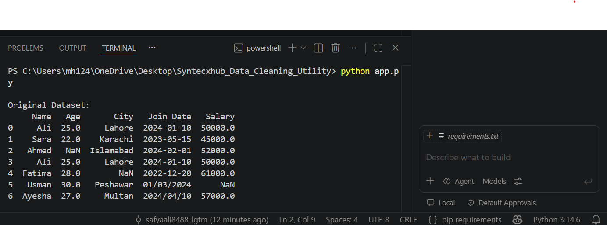
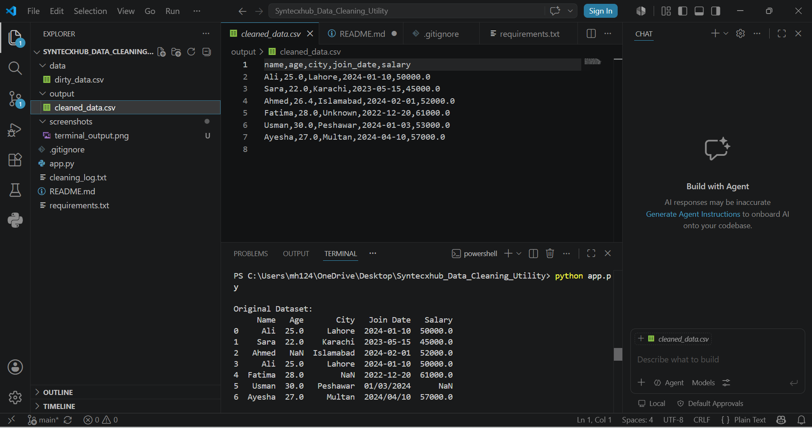
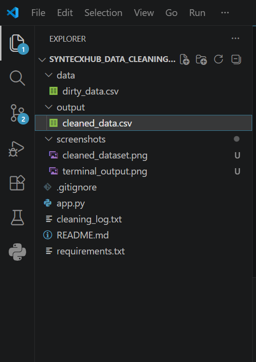
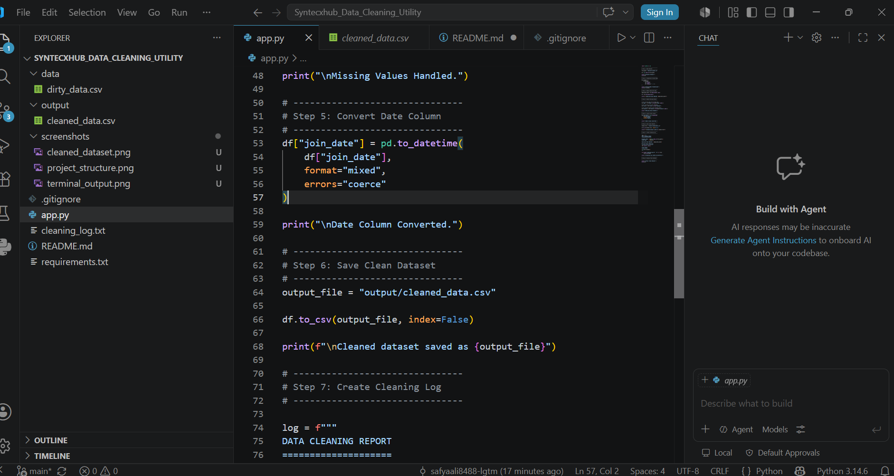

# 🧹 Syntecxhub Data Cleaning Utility

A Python-based Data Cleaning Utility developed during the **Syntecxhub Data Science Internship**.

---

# 📌 Overview

This project automates common data preprocessing tasks using Python and Pandas.

It helps prepare raw datasets for analysis by:

- Removing duplicate records
- Handling missing values
- Standardizing column names
- Converting date formats
- Exporting cleaned datasets
- Creating a cleaning report

---

# 🚀 Features

✅ Read CSV datasets

✅ Handle missing values

✅ Remove duplicate rows

✅ Standardize column names

✅ Convert dates into proper format

✅ Save cleaned dataset

✅ Generate cleaning log

---

# 🛠 Technologies Used

- Python
- Pandas
- OpenPyXL

---

# 📂 Project Structure

```text
Syntecxhub_Data_Cleaning_Utility/
│
├── app.py
├── README.md
├── requirements.txt
├── cleaning_log.txt
├── screenshots/
├── data/
└── output/
```

# 📸 Screenshots

## Terminal Output



---

## Cleaned Dataset



---

## Project Structure



---

## Source Code



---

# ▶️ Installation

```bash
pip install -r requirements.txt
```

---

# ▶️ Run

```bash
python app.py
```

---

# 📊 Output

- cleaned_data.csv

- cleaning_log.txt

---

# 👩‍💻 Developer

**Safya Ali**

BS Mathematics | Data Science Enthusiast

Syntecxhub Data Science Intern
